# Student Placement Prediction

## Introduction
Placement plays an important role in the life of a student because it usually gives him a moral boost. In this project, we'll predict whether a student will get placed or not based on several factors like gender, section, no of backlogs, whether he applied for placement training or not. This can help the College/University Management to focus on certain students.

## Dataset
The dataset contains 8 different features that we'll use to make the prediction

This is an general overview of the dataset.
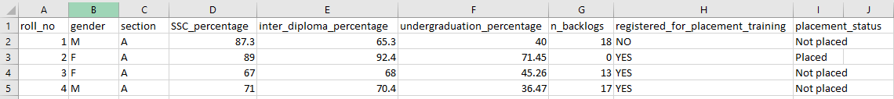

The features are
1. Roll_no: The roll number of the student (This is not used in model training as it is unique for every student). 
2. Gender: The gender of the student (M/F).
3. Section: The class section in which the student was present (A/B).
4. SSC_percentage: The percentage student got in Secondary School (10th Standard).
5. Inter_diploma_percentage: The percentage student got in in Inter diploma.
6. Undergraduation_percentage: The percentage he got in his undergraduation.
7. n_backlogs: The number of backlogs he had in his undergraduation.
8. Registered_for_placement_training: Whether he registered for placement training or not.
9. Placement_status: Was he placed or not (Placed or Not placed)

The dataset had some categorical columns which were converted to numerical using lambda fuctions.

Using the first 8 features we were prediction the value of Placement_status (whether the student got placed or not). 

The dataset was accessed by providing the URL in the TabularDatasetFactory method present in azureml package.
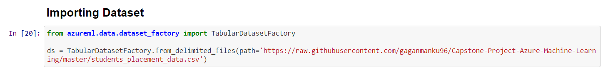

## AutoML
In AutoML, we set the task to 'classification' and the primary_metric was 'Accuracy'. We enabled early stopping and the experiment timeout was set to 30min to reduce the computation cost. The cross_validation parameter was set to 3 and lastly max_concurrent_iterations was set to 3 to run iterations in parallel to improve efficiency.
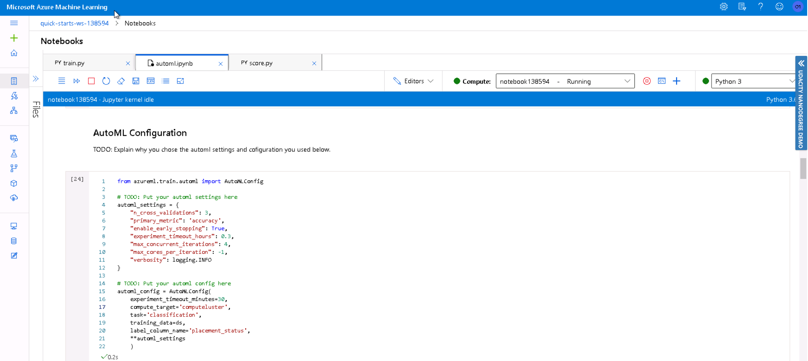

Out of all the different models that were trained using AutoML, VotingEnsemble performed the best with an accuracy of 91.45%.
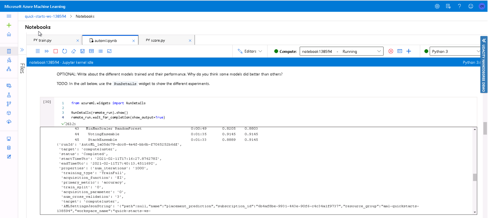
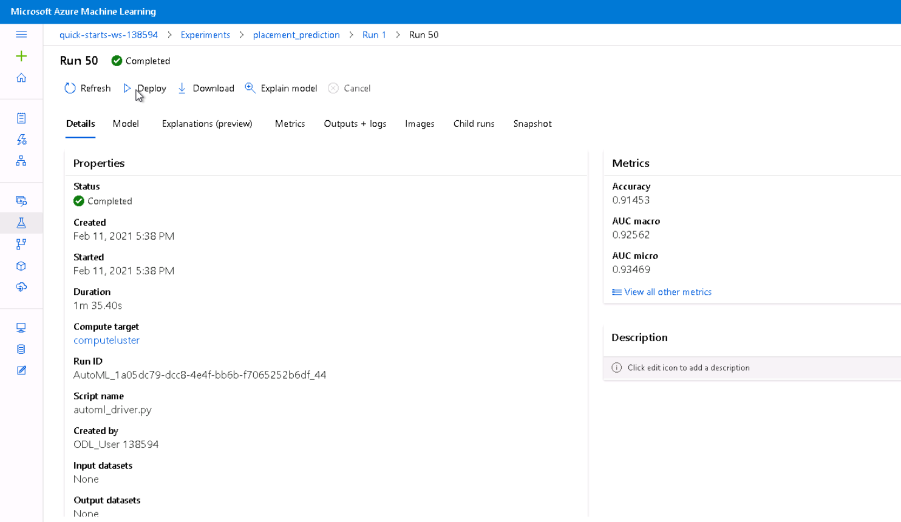

These were the parameters of the best model trained by AutoML.
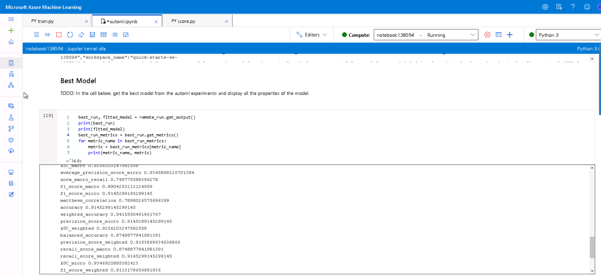

## HyperDrive
In HyperDrive, we choose RandomForest as our algorithm and the type of task was classification. The paramters we choose for hyperdrive were bandit policy for early termination (for poor performing runs), Accuracy as the primary metric and Sklearn estimator. We used RandomParameter sampling to search for best parameters.

We got an accuracy of 86% with the hyperdrive and the parameters of the best model were
```
n_estimators: 10
min_samples_split: 3
```
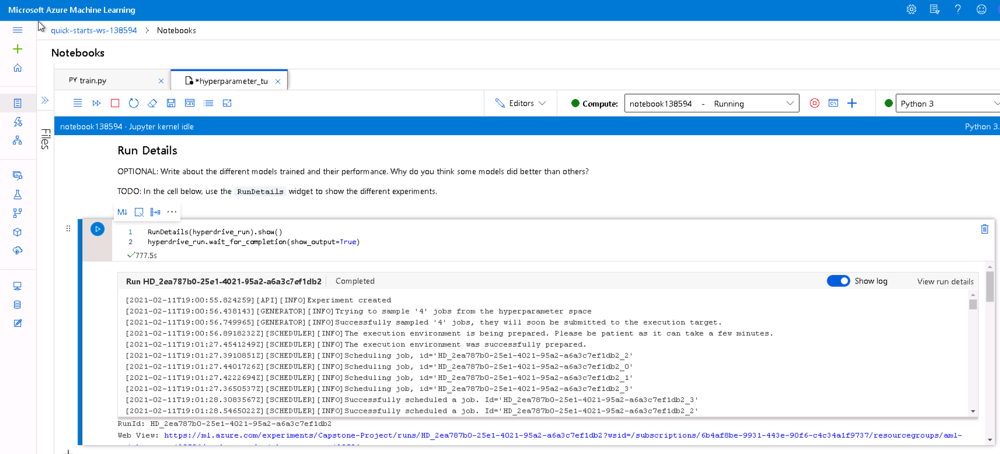
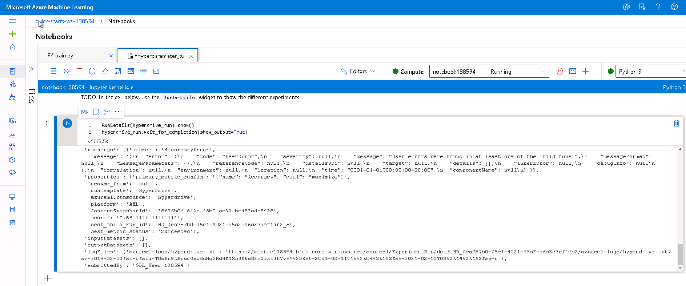

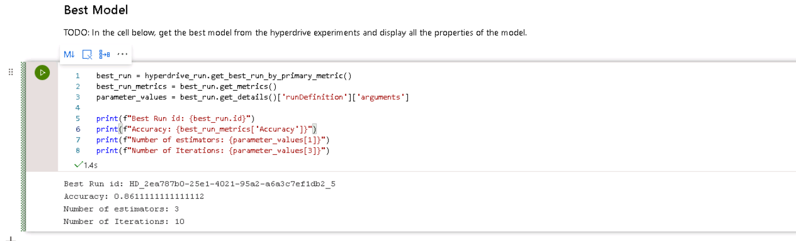

## Model Deployment
The accuracy was higher in case of AutoML model. So, we decided to deploy the VotingEnsemble model produced by AutoML. The AutoML model was saved using pickle.

The model was deployed used Azure Container Instance Webservice and authentication was enabled. The environment that we used was 'Azure-AutoML', it installed all the packages that we needed to run the model. A scoring script was also present which worked like a prediction method. Any input payload was send to this score function and it would return the result.

The model was successfully deployed and can be seen in the below screenshot.
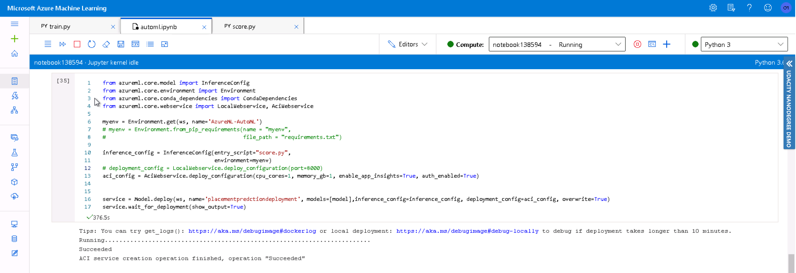 

After the model has been deployed we can also check if it is in health state.
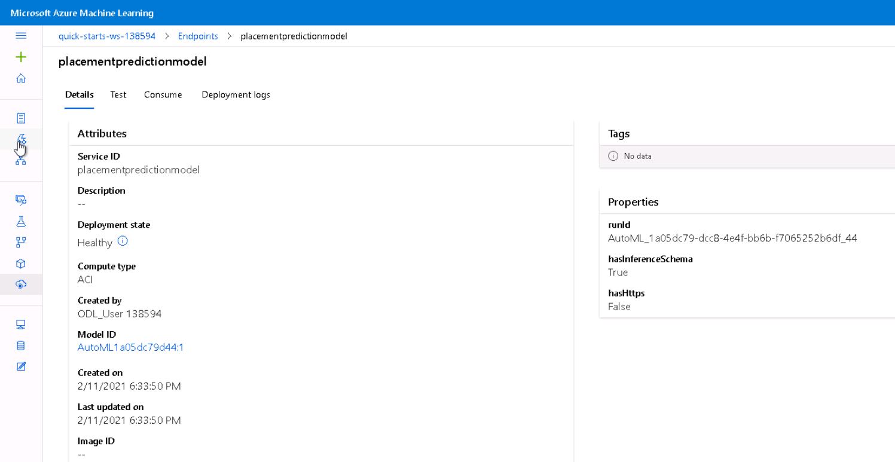
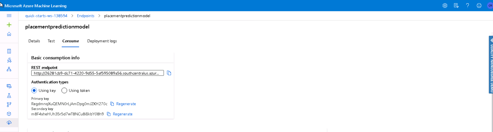

After the model was deployed, we created an input payload to test the result of the Model.
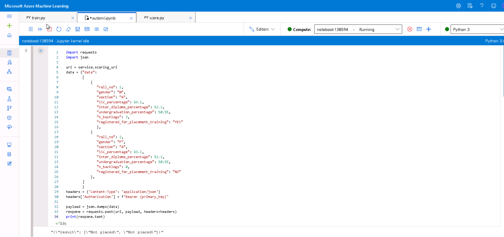

## Screen Recording
https://youtu.be/ErjdOiHvfbM

